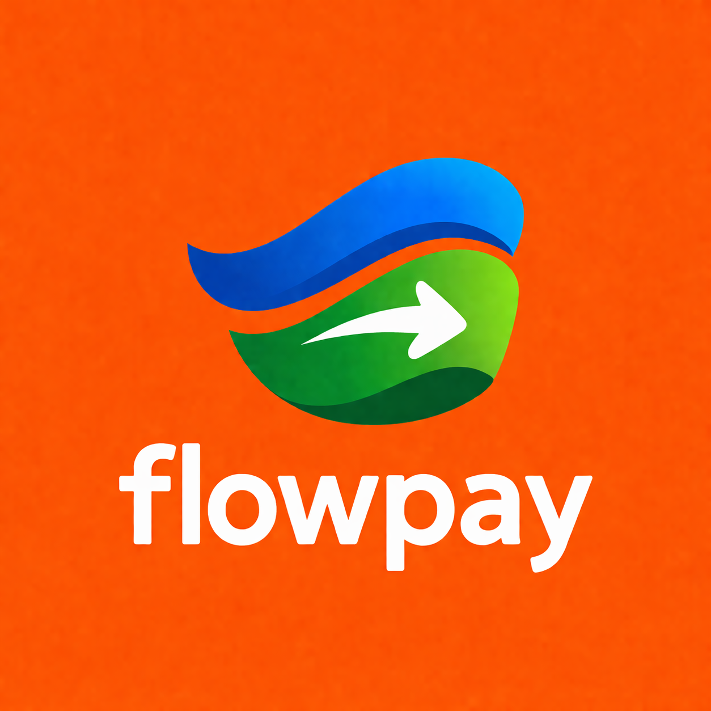
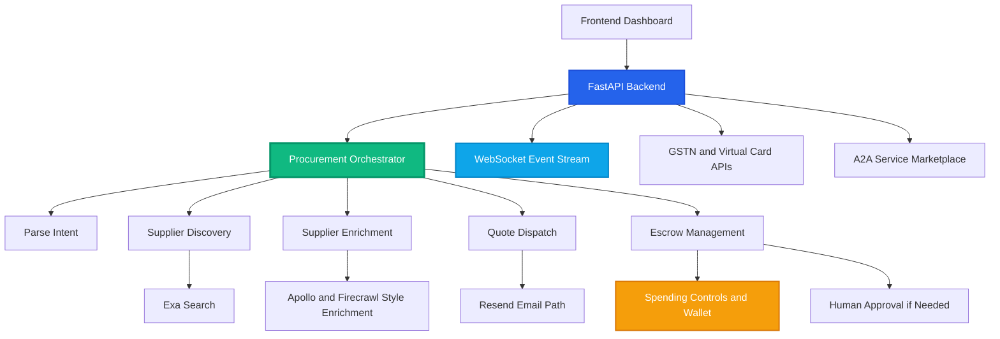
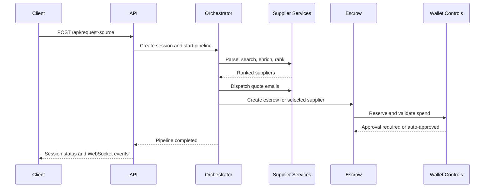

<div align="center">



# Flowpay

### Autonomous multi-agent B2B sourcing, escrow, and compliance orchestration

Move from sourcing request to supplier selection, escrow controls, approvals, and compliance actions in one real-time workflow.

[](README.md)
[](LICENSE)
[](https://www.python.org/)
[](https://fastapi.tiangolo.com/)
[](backend/main.py)
[](backend/services/spending_controls.py)
[](https://deepwiki.com/t0k1t00/flowpay-agent)

[About](#about-the-project) | [Architecture](#system-architecture) | [Agent Flow](#the-6-stage-agent-flow) | [Getting Started](#getting-started) | [API](#api-reference) | [Security](#security-and-controls)

</div>

---

## Table of Contents

- [About the Project](#about-the-project)
- [System Architecture](#system-architecture)
- [The 6-Stage Agent Flow](#the-6-stage-agent-flow)
- [Tech Stack](#tech-stack)
- [Getting Started](#getting-started)
- [Configuration](#configuration)
- [API Reference](#api-reference)
- [Security and Controls](#security-and-controls)
- [Project Structure](#project-structure)
- [Testing](#testing)
- [Troubleshooting](#troubleshooting)
- [Developers](#developers)
- [Contributing](#contributing)
- [License](#license)
- [Reference Files](#reference-files)

---

## About the Project

Flowpay is an autonomous B2B procurement and escrow workflow built for PayWithLocus-aligned sourcing use cases.

The backend code currently uses the internal codename `PayGentic`, while this README documents the project as Flowpay.

### What it does

- Parses natural language sourcing requests into structured intent
- Searches suppliers and applies enrichment/ranking for procurement decisions
- Dispatches quote emails through a Resend-style automation path
- Enforces spending controls and category guardrails before transactions
- Creates escrow records with auto-approval or human approval routing
- Streams live execution logs and financial events over WebSocket
- Supports compliance automation flows with virtual card and GST automation endpoints
- Supports A2A service listing and micropayment-backed agent task execution

### Why this exists

Procurement execution is often fragmented between discovery, communication, approvals, and payment controls. Flowpay compresses this into a single, auditable, agent-driven pipeline.

---

## System Architecture

Client requests enter FastAPI, then flow through a tool-chain orchestrator. Financial actions are guarded by wallet and spending-control checks.



### Core Components

| Component | Responsibility |
|-----------|----------------|
| FastAPI API Layer | Exposes sourcing, escrow, wallet, card, GST, and audit endpoints |
| Procurement Orchestrator | Runs multi-step tool pipeline from parse to escrow |
| Supplier Search Service | Search, scrape confirmation, enrichment, and ranking |
| Spending Controls Service | Enforces limits, category policy, and micropayment charging |
| Escrow Service | Reserve, approve/reject, release, and refund transitions |
| Compliance Services | Virtual card lifecycle and GST automation run tracking |
| A2A Marketplace Service | Agent service listing, paid task execution, and task history |
| WebSocket Manager | Streams real-time logs and workflow events to frontend |

---

## The 6-Stage Agent Flow

### Stage 1: Parse Intent

- Parse user request for material, quantity, budget, and delivery target

### Stage 2: Discover Suppliers

- Run supplier discovery flow
- Charge micropayment ledger for search operations

### Stage 3: Enrich and Rank

- Enrich discovered suppliers and adjust confidence scores
- Rank suppliers against price, delivery, verification, and fit

### Stage 4: Dispatch Quotes

- Send quote requests to top suppliers
- Log outbound communication events

### Stage 5: Create Escrow

- Reserve wallet amount for selected supplier
- Auto-approve below threshold, route higher amounts for approval

### Stage 6: Finalize and Stream

- Broadcast escrow/approval outcomes and wallet state updates
- Persist audit trail records and session summary metadata



---

## Tech Stack

### Core Runtime

| Tech | Purpose |
|------|---------|
| Python | Backend runtime |
| FastAPI | API and WebSocket server |
| Pydantic v2 | Request/response schemas |
| Uvicorn | ASGI server |
| httpx | External API client |

### Integrations and Workflow

| Integration | Purpose |
|-------------|---------|
| Exa-style search | Supplier discovery |
| Firecrawl-style scrape path | Supplier page confirmation |
| Apollo-style enrichment | Supplier enrichment and scoring |
| Resend-style email path | Quote dispatch workflow |
| Laso virtual cards | Compliance payment instruments |
| Browser Use GST automation | GST filing/payment automation path |

### Frontend

| Layer | Purpose |
|-------|---------|
| HTML/CSS/JavaScript | Dashboard and control panels |
| WebSocket client | Real-time execution event stream |

---

## Getting Started

### Prerequisites

- Python 3.10+
- `pip`
- Optional: Node.js (if you prefer `npx serve` for frontend)

### 1) Run backend

```bash
cd backend
python3 -m venv .venv
source .venv/bin/activate
pip install -r requirements.txt
cp .env.example .env
python main.py
```

Backend starts at `http://localhost:8000`.

### 2) Run frontend

Option A: Python static server

```bash
cd frontend
python3 -m http.server 5500
```

Then open `http://localhost:5500/index.html`.

Option B: Node static server

```bash
cd frontend
npx serve .
```

### 3) Verify health

```bash
curl http://localhost:8000/health
```

### 4) Connect to live logs

WebSocket endpoint: `ws://localhost:8000/ws/logs`

---

## Configuration

Copy `backend/.env.example` to `backend/.env` and update values for your environment.

| Variable | Description | Default |
|----------|-------------|---------|
| `USE_LIVE_APIS` | Enable live API mode for integrations | `false` |
| `USE_LOCUS_WRAPPED_APIS` | Route via Locus wrapped endpoints | `false` |
| `STRICT_INTEGRATIONS` | Fail loudly instead of degrading to mock behavior | `false` |
| `REQUIRE_API_KEY` | Enforce `x-api-key` or bearer auth for API endpoints | `false` |
| `FLOWPAY_API_KEY` | API key used when auth enforcement is enabled | unset |
| `ENABLE_API_DOCS` | Enable `/docs` and `/redoc` endpoints | `true` |
| `LOCUS_API_KEY` | Locus API key for wrapped calls | unset |
| `LOCUS_API_BASE` | Base URL for wrapped API gateway | `https://api.paywithlocus.com/api` |
| `LOCUS_402_APPROVAL_ENDPOINT` | Endpoint to settle HTTP 402 payment-required events | `/payments/approve` |
| `LOCUS_WALLET_DEBIT_ENDPOINT` | Wallet debit endpoint | `/wallet/debit` |
| `LOCUS_WALLET_CREDIT_ENDPOINT` | Wallet credit endpoint | `/wallet/credit` |
| `LOCUS_ESCROW_CREATE_ENDPOINT` | Escrow creation endpoint | `/escrow/create` |
| `LOCUS_ESCROW_TRANSITION_ENDPOINT` | Escrow transition endpoint | `/escrow/transition` |
| `EXA_API_KEY` | Exa API key (live mode) | unset |
| `FIRECRAWL_API_KEY` | Firecrawl API key (live mode) | unset |
| `RESEND_API_KEY` | Resend API key (live mode) | unset |
| `RESEND_FROM_EMAIL` | Sender identity for outbound quote emails | `Flowpay <noreply@flowpay.ai>` |
| `APOLLO_API_KEY` | Apollo/Clado enrichment key for live supplier enrichment | unset |
| `APOLLO_ENRICH_ENDPOINT` | Live enrichment endpoint for supplier identity enrichment | unset |
| `A2A_SHARED_TOKEN` | Optional bearer token for remote A2A service execution | unset |
| `OPENAI_API_KEY` | Enables LLM planning and LLM parsing paths | unset |
| `AGENT_MODEL` | LLM model used by parser and decision engine | `gpt-4o-mini` |
| `AUTO_APPROVE_THRESHOLD` | Amount threshold for auto-approval | `2000` |
| `MONTHLY_SPEND_LIMIT` | Monthly wallet spend cap | `30000` |
| `DAILY_SPEND_LIMIT` | Daily wallet spend cap | `10000` |
| `WALLET_BALANCE` | Initial wallet balance | `50000` |
| `ALLOWED_VENDOR_CATEGORIES` | Allowed escrow categories (comma-separated) | `cotton yarn,textile dye,steel rod,machine parts` |

---

## API Reference

### Workflow and Sessions

- `POST /api/request-source` - Start sourcing pipeline session
- `GET /api/session/{session_id}` - Get session status and summary
- `GET /api/suppliers` - List suppliers (optional `material` query)
- `POST /api/send-email` - Send quote request email to supplier
- `WS /ws/logs` - Stream real-time agent events

### Escrow and Approvals

- `POST /api/create-escrow` - Create escrow reservation
- `GET /api/escrows` - List escrows
- `GET /api/approvals` - Pending/history approval feed
- `POST /api/approve-payment` - Approve escrow payment
- `POST /api/reject-payment` - Reject escrow payment
- `POST /api/release-escrow` - Release locked escrow
- `POST /api/refund-escrow` - Refund escrow amount

### Wallet and Controls

- `GET /api/wallet-state` - Current wallet state
- `POST /api/wallet-topup` - Credit wallet balance
- `GET /api/wallet-ledger` - Wallet ledger entries
- `GET /api/spending-controls` - Read active controls
- `PUT /api/spending-controls` - Update controls

### Compliance and Cards

- `POST /api/virtual-cards` - Create virtual card
- `GET /api/virtual-cards` - List virtual cards
- `GET /api/virtual-cards/{card_id}` - Card details
- `POST /api/virtual-cards/debit` - Debit virtual card
- `GET /api/virtual-cards/{card_id}/transactions` - Card transaction history
- `POST /api/gstn/automate` - Run GST automation flow
- `GET /api/gstn/runs` - List GST automation runs

### A2A Marketplace

- `POST /api/a2a/services/register` - Register an agent-provided service with unit pricing
- `GET /api/a2a/services` - List registered services with capability and price filters
- `POST /api/a2a/tasks/execute` - Execute a paid A2A task against a selected service
- `GET /api/a2a/tasks` - List A2A task runs and outcomes

### Audit and Health

- `GET /api/audit-trail` - Retrieve audit entries
- `GET /health` - Service health, DB readiness, and provider readiness summary
- `GET /health/ready` - Readiness check including DB and live provider health

### Example Request

```json
{
  "query": "Need 1200kg cotton yarn under 300 per kg within 5 days",
  "session_id": "demo_flow_01"
}
```

### Example Start Response

```json
{
  "status": "started",
  "session_id": "demo_flow_01"
}
```

---

## Security and Controls

- Spending policy checks run before escrow reservation and API micropayments
- Category allow-list is enforced for procurement transactions
- Human-in-the-loop approval triggers above threshold values
- Wallet ledger records top-ups, escrow actions, refunds, and API usage charges
- Audit trail captures workflow and compliance events

---

## Project Structure

```text
flowpay-agent/
+-- README.md
+-- branding/
|   +-- Flowpay_Logo.png
|   `-- Minimal_Flowpay_Logo.png
+-- backend/
|   +-- main.py
|   +-- models.py
|   +-- requirements.txt
|   +-- .env.example
|   +-- database/
|   |   +-- __init__.py
|   |   `-- db.py
|   +-- services/
|   |   +-- __init__.py
|   |   +-- audit_service.py
|   |   +-- a2a_marketplace_service.py
|   |   +-- browser_use_service.py
|   |   +-- email_service.py
|   |   +-- escrow_service.py
|   |   +-- laso_service.py
|   |   +-- locus_client.py
|   |   +-- orchestrator.py
|   |   +-- payment_required.py
|   |   +-- parser.py
|   |   +-- provider_health.py
|   |   +-- reliability.py
|   |   +-- runtime_config.py
|   |   +-- security.py
|   |   +-- spending_controls.py
|   |   `-- supplier_search.py
|   +-- tests/
|   |   +-- __init__.py
|   |   `-- test_boundary_suite.py
|   `-- websocket/
|       +-- __init__.py
|       `-- manager.py
`-- frontend/
    +-- index.html
    +-- suppliers.html
    +-- approvals.html
    +-- audit.html
    `-- settings.html
```

---

## Testing

Run the backend boundary suite:

```bash
cd backend
python -m unittest discover -s tests -p "test_*.py"
```

Current tests cover:

- Daily spend limit breach rejection
- Disallowed category rejection
- Virtual card limit enforcement
- GST automation audit record generation
- Readiness endpoint validation
- GST run persistence listing
- Virtual card transaction persistence listing

---

## Troubleshooting

| Problem | Fix |
|---------|-----|
| Backend does not start | Activate venv and re-run `pip install -r backend/requirements.txt` |
| Frontend does not show live events | Check backend is running and WebSocket endpoint `/ws/logs` is reachable |
| Escrow creation fails unexpectedly | Verify `DAILY_SPEND_LIMIT`, `MONTHLY_SPEND_LIMIT`, and category allow-list |
| Live integrations not working | Confirm `USE_LIVE_APIS=true` plus required API keys are set |
| Wrapped API calls failing | Verify `LOCUS_API_KEY` and `LOCUS_API_BASE` |

---

## Developers

1. Keerthivasan S V
2. Swathi B Raj

---

## Contributing

1. Create a feature branch
2. Implement your changes with tests where relevant
3. Run backend tests
4. Open a pull request with clear scope and rationale

---

## License

This project is licensed under the Flowpay Proprietary License.

See [LICENSE](LICENSE) for full terms.

---

## Reference Files

- [backend/main.py](backend/main.py)
- [backend/services/orchestrator.py](backend/services/orchestrator.py)
- [backend/services/a2a_marketplace_service.py](backend/services/a2a_marketplace_service.py)
- [backend/services/spending_controls.py](backend/services/spending_controls.py)
- [backend/services/supplier_search.py](backend/services/supplier_search.py)
- [backend/services/escrow_service.py](backend/services/escrow_service.py)
- [backend/services/browser_use_service.py](backend/services/browser_use_service.py)
- [backend/services/laso_service.py](backend/services/laso_service.py)
- [backend/services/provider_health.py](backend/services/provider_health.py)
- [backend/services/payment_required.py](backend/services/payment_required.py)
- [backend/database/db.py](backend/database/db.py)
- [backend/tests/test_boundary_suite.py](backend/tests/test_boundary_suite.py)

---

<div align="center">

Flowpay

</div>